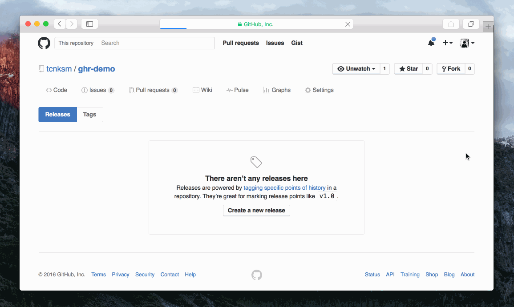

ghr
====

[][release]
[](https://travis-ci.org/tcnksm/ghr)
[][godocs]
[][license]

[release]: https://github.com/tcnksm/ghr/releases
[license]: https://github.com/tcnksm/ghr/blob/master/LICENSE
[godocs]: http://godoc.org/github.com/tcnksm/ghr

`ghr` creates GitHub Release and uploads artifacts in parallel.

## Demo

This demo creates GitHub Release page with `v1.0.0` tag and uploads cross-compiled golang binaries.



You can see release page [here](https://github.com/tcnksm/ghr-demo/releases/tag/v1.0.0).

## Usage

To use `ghr` is simple. After setting GitHub API token (see more on [GitHub API Token](#github-api-token) section), change GitHub repository root directory and run the following command,

```bash
$ ghr [option] TAG PATH
```

You must provide `TAG` (git tag) and `PATH` to artifacts you want to upload. You can specify a file or a directory. If you provide a directory, all files in that directory uploaded.

`ghr` assumes that you are in the GitHub repository root when executed. This is because normally the artifacts you want to upload to a GitHub Release page is in that repository or generated there. With this assumption, `ghr` *implicitly* reads repository URL from `.git/config` file. But You can change this kind of information via option, see [Options](#options) section.

### GitHub API Token

To use `ghr`, you need to get a GitHub token with an account which has enough permissions to to create releases. To get token, first, visit GitHub account settings page, then go to Applications for the user. Here you can create a token in the Personal access tokens section. For a private repository you need `repo` scope and for a public repository you need `public_repo` scope.

When using `ghr`, you can set it via `GITHUB_TOKEN` env var, `-token` command line option or `github.token` property in `.gitconfig` file.

For instance, to set it via environmental variable:

```bash
$ export GITHUB_TOKEN="....."
```

Or set it in `github.token` in gitconfig:

```bash
$ git config --global github.token "....."
```

Note that environmental variable takes priority over gitconfig value.

### GitHub Enterprise

You can use `ghr` for GitHub Enterprise. Change API endpoint via the enviromental variable.

```bash
$ export GITHUB_API=http://github.company.com/api/v3
```

## Example

To upload all package in `pkg` directory with tag `v0.1.0`

```bash
$ ghr v0.1.0 pkg/
--> Uploading: pkg/0.1.0_SHASUMS
--> Uploading: pkg/ghr_0.1.0_darwin_386.zip
--> Uploading: pkg/ghr_0.1.0_darwin_amd64.zip
--> Uploading: pkg/ghr_0.1.0_linux_386.zip
--> Uploading: pkg/ghr_0.1.0_linux_amd64.zip
--> Uploading: pkg/ghr_0.1.0_windows_386.zip
--> Uploading: pkg/ghr_0.1.0_windows_amd64.zip
```

## Options

You can set some options:

```bash
$ ghr \
    -t TOKEN \        # Set Github API Token
    -u USERNAME \     # Set Github username
    -r REPO \         # Set repository name
    -c COMMIT \       # Set target commitish, branch or commit SHA
    -b BODY \         # Set text describing the contents of the release
    -p NUM \          # Set amount of parallelism (Default is number of CPU)
    -delete \         # Delete release and its git tag in advance if it exists
    -draft \          # Release as draft (Unpublish)
    -prerelease \     # Crate prerelease
    TAG PATH
```

## Install

If you are OSX user, you can use [Homebrew](http://brew.sh/):

```bash
$ brew tap tcnksm/ghr
$ brew install ghr
```

If you are in another platform, you can download binary from [release page](https://github.com/tcnksm/ghr/releases) and place it in `$PATH` directory.

Or you can use `go get` (you need to use go1.7 or later),

```bash
$ go get -u github.com/tcnksm/ghr
```

## VS.

- [aktau/github-release](https://github.com/aktau/github-release) - `github-release` can also create and edit releases and upload artifacts. It has many options. `ghr` is a simple alternative. And `ghr` will parallelize upload artifacts.

## Contribution

1. Fork ([https://github.com/tcnksm/ghr/fork](https://github.com/tcnksm/ghr/fork))
1. Create a feature branch
1. Commit your changes
1. Rebase your local changes against the master branch
1. Run test suite with the `make test` command and confirm that it passes
1. Run `gofmt -s`
1. Create new Pull Request


## Author

[Taichi Nakashima](https://github.com/tcnksm)
